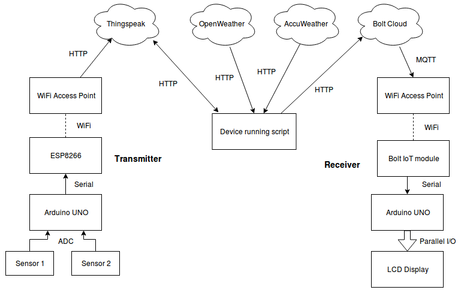

# ClimateDAS_IoT
Repository for Data Acquisition System to obtain climatic and sensor data using BoltIoT platform, ESP8266 and Arduino UNO

* src/Display_arduino/Display_arduino.ino:   
Code for Arduino at the receiver/display circuit   

* src/Sensor_arduino/Sensor_arduino.ino:   
Code for Arduino at the transmitter/sensing circuit   

* src/Sensor_esp/Sensor_esp.ino:   
Code for ESP8266 at the transmitter/sensing circuit   

* src/conf.py:   
Code for configuration and API key details   

* src/DAS_script.py:   
Code to be run on the 'script running device'   

* tests/:   
Example files for testing   

* boardfiles/Fritzing/:   
Fritzing files for circuit board view   

* Project details:   
https://www.hackster.io/pankajpatro703/iot-based-sensor-climate-monitoring-using-boltiot-platform-748e38   

